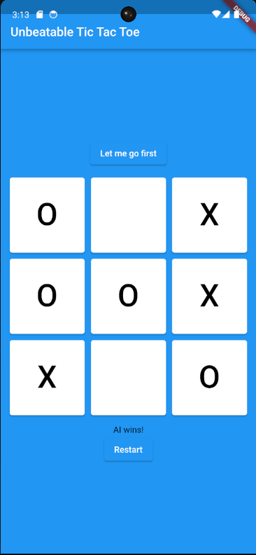
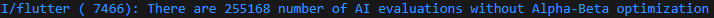
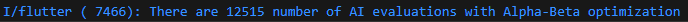

# Unbeatable Tic Tac Toe

A single-player Tic-Tac-Toe mobile game with the opponent being an unbeatable AI, developed with Flutter.

## Demo

## The AI

The AI is powered by the Minimax algorithm, which is a popular decision-making alogrithm. Combined with
the Alpha-Beta Pruning optimization algorithm, I was able to significantly reduce the overall search runtime.

In the snippet below, the numbers of evaluations made by AI decreased from 255,168 (without Alpha-Beta Pruning) to 12,515 (with Alpha-Beta Pruning). In other words,
this is about 95% decrease in evaluations.

